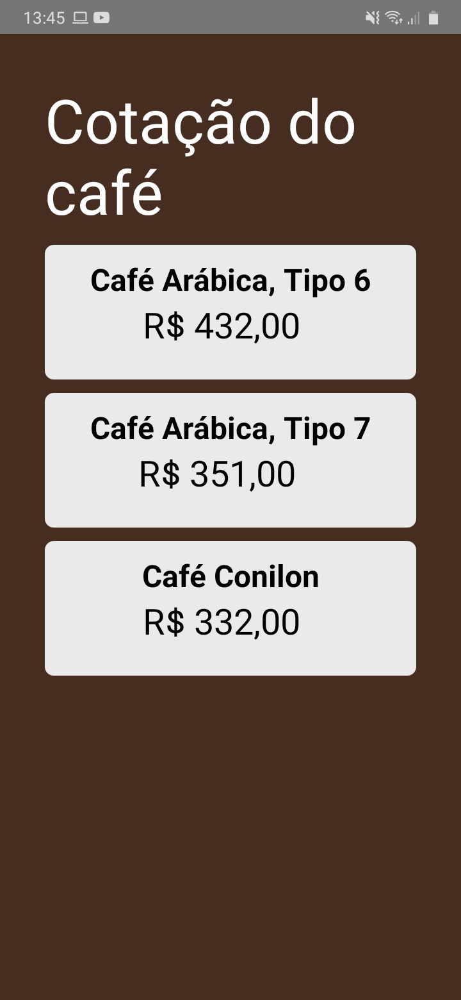

# CotacaoCafé Web crawler with react-native!

<h3>Meu primeiro app! My first app!</h3>
<h4>Aplicativo feito em react-native que mostra as cotações do café no ES </h4>

Utilizei a biblioteca react-native-cheerio para fazer o web crawn dos preços 

 Showing coffe prices in a react-native app by web crawnling the values using react-native-cheerio, take a look at "buscar.js"  

 
